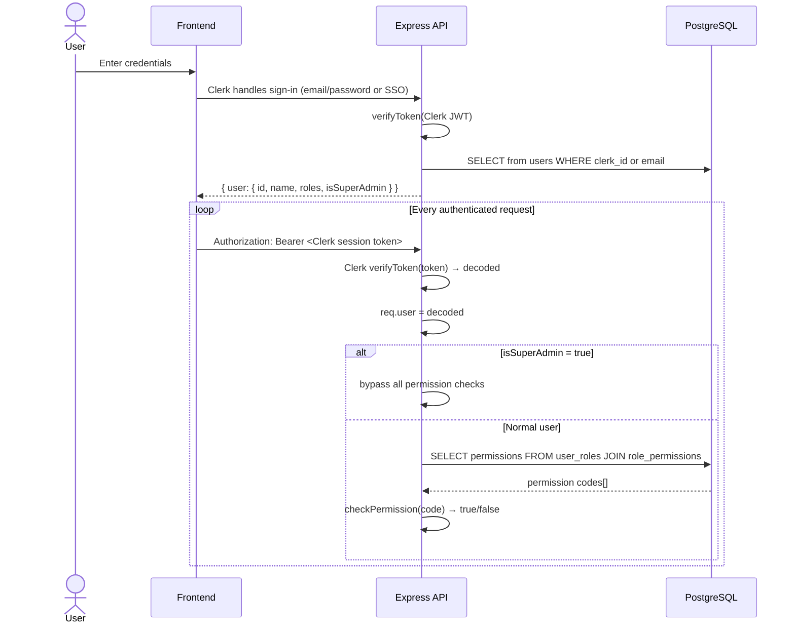
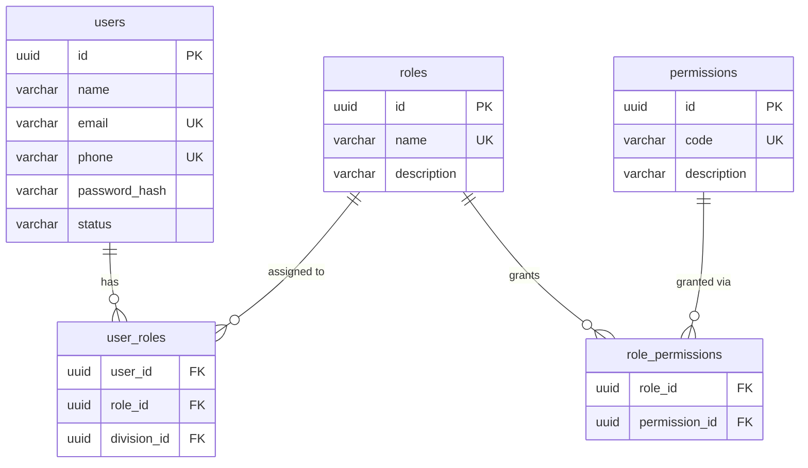
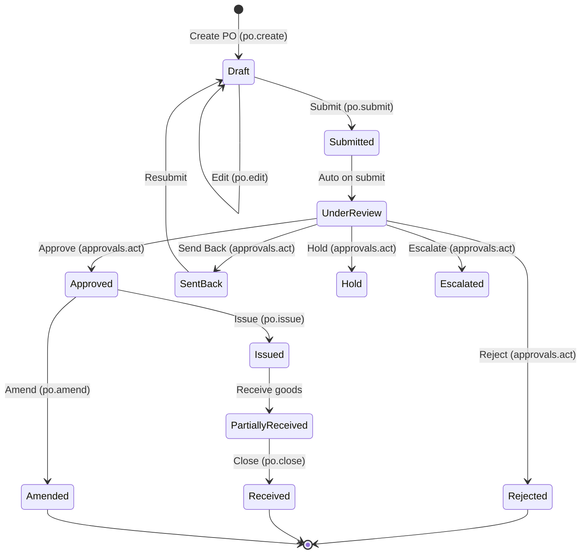
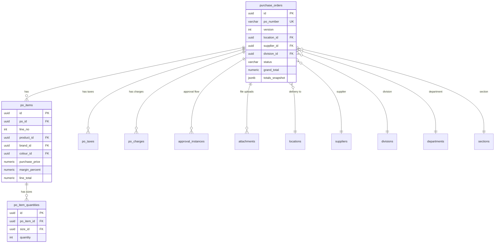
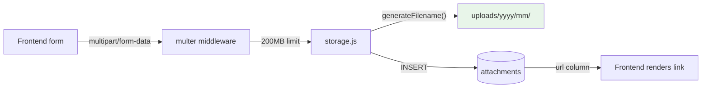
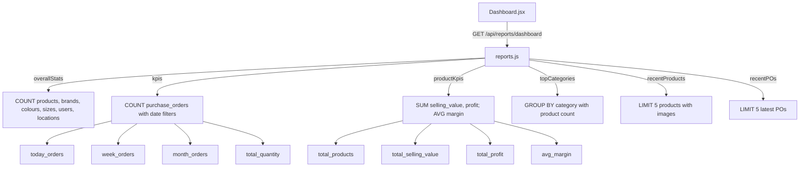
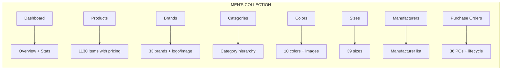

# System Architecture — BSC Exclusive POMS

## High-Level Architecture

```mermaid
graph TB
    subgraph Frontend["React + Vite SPA"]
        A[Login / Auth] --> B[Dashboard]
        B --> C[Men's Collection]
        C --> C1[Products]
        C --> C2[Brands]
        C --> C3[Categories]
        C --> C4[Colors]
        C --> C5[Sizes]
        C --> C6[Manufacturers]
        C --> C7[Purchase Orders]
        B --> D[Management]
        D --> D1[Locations]
        D --> D2[Suppliers]
        D --> D3[Divisions]
        D --> D4[Users]
        B --> E[Reports]
        B --> F[System]
        F --> F1[Audit Logs]
        F --> F2[Settings]
    end

    Frontend -- "REST API (JSON)" --> Backend
    Frontend -- "JWT Bearer Token" --> Backend

    subgraph Backend["Express.js + Node.js"]
        G[Auth Middleware] --> H[Routes]
        H --> H1[/auth]
        H --> H2[/masters]
        H --> H3[/purchase-orders]
        H --> H4[/reports]
        H --> H5[/notifications]
        H --> H6[/locations]
        H --> H7[/product-types]
        G --> I[RBAC Permissions]
    end

    Backend -- "SQL (pg library)" --> Database

    subgraph Database["PostgreSQL"]
        J[(users / roles / user_roles)]
        K[(permissions / role_permissions)]
        L[(brands / categories / subcategories / product_types)]
        M[(products / product_variants / colours / sizes / manufacturers)]
        N[(purchase_orders / po_items / po_item_quantities)]
        O[(approvals / approval_instances / approval_actions)]
        P[(locations / divisions / departments / sections / suppliers)]
        Q[(audit_logs / settings / notifications)]
        R[(attachments)]
    end

    Backend -- "multer" --> FS[(Uploads ./uploads/yyyy/mm/)]
```

## Authentication & Authorization Flow



## RBAC Permission Model



**Permission codes** — 50+ codes covering:
- `masters.read`, `masters.write` — all master data CRUD
- `po.view`, `po.create`, `po.edit`, `po.submit`, `po.amend`, `po.issue`, `po.close`
- `approvals.view`, `approvals.act`
- `reports.read`
- `settings.write`
- `users.admin`
- `product_types.read`, `product_types.write`

**Admin bypass**: Both `super_admin` and `admin` roles bypass all permission checks (`auth.js:isSuperAdmin`).

## Purchase Order Lifecycle



## PO Data Model



## File Upload & Storage



## Dashboard Data Flow



## Men's Collection Navigation



## Frontend Routing

| Path | Component | Permission |
|---|---|---|
| `/login` | Login | — |
| `/men/dashboard` | Dashboard | — |
| `/men/products` | Products | `masters.read` |
| `/men/brands` | Brands | `masters.read` |
| `/men/categories` | Categories | `masters.read` |
| `/men/colors` | Colors | `masters.read` |
| `/men/sizes` | Sizes | `masters.read` |
| `/men/manufacturers` | Manufacturers | `masters.read` |
| `/men/purchase-orders` | PurchaseOrders | `po.view` |
| `/locations` | Locations | `masters.read` |
| `/purchase-orders/new` | POCreate | `po.create` |
| `/purchase-orders/:id` | PODetails | `po.view` |
| `/reports` | Reports | `reports.read` |
| `/settings` | Settings | `settings.write` |
| `/audit` | AuditLogs | `settings.write` |

## API Endpoints Summary

| Method | Endpoint | Description |
|---|---|---|
| POST | `/api/auth/login` | JWT authentication |
| GET | `/api/auth/me` | Current user + permissions |
| GET | `/api/reports/dashboard` | Dashboard stats (overall + KPIs + product KPIs) |
| GET | `/api/brands` | List brands |
| POST | `/api/brands/:id/logo` | Upload brand logo |
| POST | `/api/brands/:id/image` | Upload brand image |
| GET | `/api/colours` | List colors |
| POST | `/api/colours/:id/image` | Upload color image |
| GET | `/api/locations` | List locations |
| POST | `/api/locations` | Create location |
| PATCH | `/api/locations/:id` | Update location |
| DELETE | `/api/locations/:id` | Delete location |
| GET | `/api/product-types` | List product types |
| POST | `/api/product-types` | Create product type |
| PATCH | `/api/product-types/:id` | Update product type |
| DELETE | `/api/product-types/:id` | Delete product type |
| GET | `/api/purchase-orders` | List POs with pagination |
| POST | `/api/purchase-orders` | Create PO |
| GET | `/api/purchase-orders/:id` | PO detail with location |
| POST | `/api/purchase-orders/:id/submit` | Submit PO |
| POST | `/api/purchase-orders/:id/issue` | Issue PO |
| POST | `/api/purchase-orders/:id/amend` | Amend PO |
| POST | `/api/purchase-orders/:id/close` | Close PO |
| POST | `/api/purchase-orders/:id/approval-action` | Approve/reject/hold/escalate |
| GET | `/api/purchase-orders/:id/pdf` | Download PO as PDF |
| GET | `/api/purchase-orders/:id/csv` | Download PO as CSV |
| GET | `/api/notifications` | List notifications |
| GET | `/api/audit-logs` | Audit log history |
