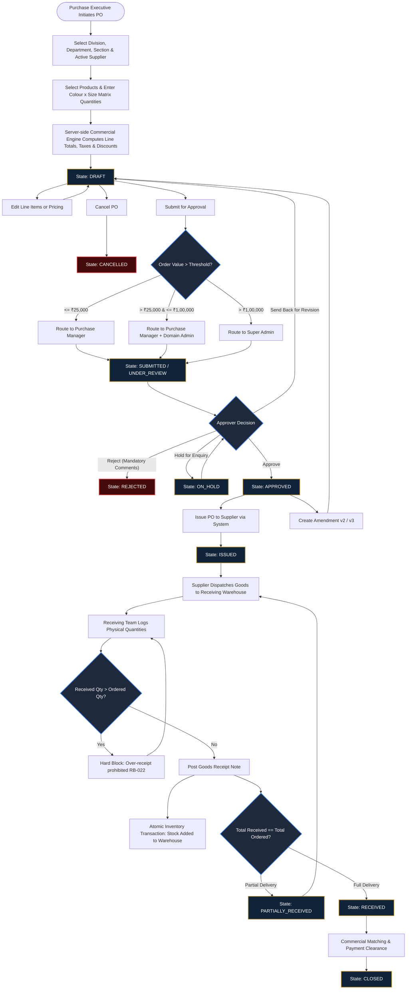
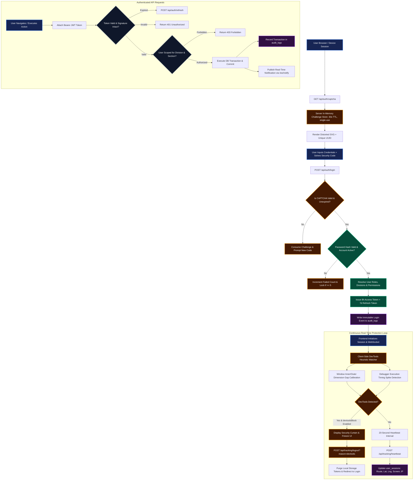

# BSC Exclusive — Purchase Order Management System (POMS)
## Next-Generation Production System Design Document

---

## 1. Executive Summary & Architecture Overview

**POMS (Purchase Order & Merchandise Procurement Management System)** is an enterprise-grade, high-throughput procurement desk built exclusively for **BSC Exclusive Private Limited**. Designed to handle multi-division, multi-category retail procurement (covering over 1,130 products across apparel, menswear, jewellery, sarees, and home goods), POMS enforces strict commercial governance (FRS v2.0, 31 operational sections + 4 appendices).

### 1.1 Technology Stack

```
┌────────────────────────────────────────────────────────────────────────┐
│                        PRESENTATION TIER                               │
│  React 18 + Vite 5 (SPA) · Vanilla Responsive CSS Design System        │
│  WebSocket Client · DevTools Heuristic Security Watcher · ErrorBoundary│
└───────────────────────────────────┬────────────────────────────────────┘
                                    │ HTTP/REST & WSS (JWT Authenticated)
┌───────────────────────────────────▼────────────────────────────────────┐
│                        APPLICATION API TIER                            │
│  Node.js 20+ & Express (ES Modules) · Native WS WebSocket Server       │
│  State Machine Engine · In-Memory CAPTCHA Engine · Dependency-free PDF │
└───────────────────────────────────┬────────────────────────────────────┘
                                    │ Connection Pool (node-postgres pg)
┌───────────────────────────────────▼────────────────────────────────────┐
│                         PERSISTENCE TIER                               │
│  PostgreSQL 17 with Strict Constraints · Foreign Key Cascades          │
│  Atomic Transactions · Append-Only Immutable Audit Logs · JSONB Snap   │
└────────────────────────────────────────────────────────────────────────┘
```

- **Frontend**: React 18, React Router v6, Axios, Vanilla CSS with custom design tokens, dark/bright mode theming, SVG drawing, responsive data grid.
- **Backend API**: Node.js, Express, native WS for live notifications, JWT with 8h access and 7d refresh token rotation, in-memory single-use cryptographic CAPTCHA challenge store.
- **Database**: PostgreSQL 17, relational normalized core with denormalized immutable JSONB snapshots for products, brands, and colours at the moment of PO creation.
- **Reporting & Exports**: Native RFC 4180 CSV export with UTF-8 BOM, dependency-free binary PDF 1.4 compiler supporting embedded company assets, vector drawing primitives, and A4 pagination.

---

## 2. Core Subsystems & Responsibilities

| Subsystem | Core Responsibilities | Key Database Tables |
|---|---|---|
| **Authentication & RBAC** | Credential validation, 30s CAPTCHA challenge, division/section authorization scoping, JWT issuance. | `users`, `roles`, `permissions`, `user_roles`, `user_divisions`, `user_sections` |
| **Security & Live Tracking** | Live user heartbeat (every 20s), browser window gap & debugger probe detection, instant session revocation, geo-audit. | `user_sessions`, `settings` |
| **Master Data Management** | Hierarchical catalog: Divisions → Departments → Sections → Categories → Brands → Product Types → Sizes & Colours. | `divisions`, `departments`, `sections`, `categories`, `brands`, `colours`, `sizes`, `locations`, `suppliers` |
| **Purchase Order Engine** | Multi-step guided creation, colour × size matrix quantity grid, automated commercial computation, versioning & amendment chains. | `purchase_orders`, `purchase_order_items`, `purchase_order_quantities`, `purchase_order_taxes`, `purchase_order_charges` |
| **Approval Engine** | Configurable financial limit routing (e.g. ₹25,000 / ₹1,00,000 thresholds), multi-level actions (Approve, Reject, Send Back, Hold, Escalate). | `approval_rules`, `approval_levels`, `approval_instances`, `approval_actions` |
| **Receiving & Stock Accounting** | Goods Receipt Note (GRN) generation, partial shipment tracking, over-receipt hard blocking, automated inventory balance adjustment. | `receipts`, `receipt_items`, `inventory_transactions` |
| **Export & Reporting** | On-demand branded PDF generation with company header and digital stamps, complete itemized CSV exports with Excel compatibility. | `company_settings`, `export_jobs` |
| **Audit & Governance** | Append-only immutable trail recording who did what, when, IP address, before/after values, and entity relationships. | `audit_logs` |

---

## 3. System Design Flow Diagrams

### 3.1 Flow Diagram 1: Complete Purchase Order Lifecycle & State Machine

This diagram details the lifecycle of a Purchase Order from initial catalog selection through multi-level approval routing, supplier issuance, warehouse delivery, and automated inventory balance updates.



---

### 3.2 Flow Diagram 2: Authentication, Security & Real-Time Tracking Architecture

This diagram illustrates how client requests are protected from bot abuse via single-use CAPTCHAs, authenticated with short-lived JWT tokens, continuously monitored for unauthorized developer tool inspection, and recorded into the immutable audit trail.



---

## 4. Database Schema & Data Models

### 4.1 Purchase Order Tables
- **`purchase_orders`**: Primary entity containing `po_number` (unique, e.g. `PO-DVG-2026-00001`), version counter, parent reference for amendment chains, timestamps, division, department, section, supplier reference, and summary amounts (`subtotal`, `order_discount_amount`, `tax_amount`, `charges_amount`, `grand_total`).
- **`purchase_order_items`**: Line items snapshotting product SKU, description, brand code, colour, purchase price, margin %, discount value, and line total.
- **`purchase_order_quantities`**: Size-by-size quantity breakdown for each line item (e.g. `M: 20`, `L: 30`, `XL: 10`).
- **`purchase_order_taxes`**: Itemized tax breakdown (CGST, SGST, IGST) calculated against taxable base.
- **`purchase_order_charges`**: Freight, insurance, packaging, and handling charges.

### 4.2 Supplier & Buyer Tables
- **`suppliers`**: Vendors linked to multi-division authorizations, GSTIN, PAN, credit payment terms (`net_30`, `net_60`), and contact records.
- **`company_settings`**: Buyer organizational profile ("BSC Exclusive Private Limited") containing registered commercial address, tax IDs, CIN, and branding URLs.
- **`locations`**: Distribution hubs, regional warehouses, and flagship boutique stores with dispatch and delivery coordinates.

---

## 5. Export Architecture

### 5.1 Purchase Order CSV Export Engine
The CSV generator outputs clean RFC 4180 strings formatted with a `\uFEFF` UTF-8 Byte Order Mark. It organizes the document into 6 distinct analytical blocks:
1. **Buyer Header**: Full corporate entity, address, GSTIN, and division context.
2. **Seller Header**: Complete vendor credentials, contact numbers, and tax identification.
3. **PO Metadata**: PO number, amendment version, purchase date, delivery date, terms, and tax scheme.
4. **Line Items Matrix**: Granular breakdown of SKU, brand, color, size quantities, rate, margin, discount, and line totals.
5. **Tax & Financial Ledger**: Subtotal, CGST/SGST/IGST breakdown, freight, and grand total.
6. **Procurement Declarations**: Standard terms, inspection clauses, and jurisdiction.

### 5.2 Purchase Order Branded PDF Compiler
PDF generation operates completely dependency-free via `pdfWriter.js`, converting high-level page primitives into standard binary PDF 1.4 objects:
- **XObject Image Embedding**: Incorporates the official BSC logo as an embedded XObject without third-party libraries.
- **Top-Down Coordinate Mapping**: Translates application layout coordinates into bottom-up PostScript user space.
- **Dynamic Pagination**: Automatically computes item heights and pushes continuation pages with repeated headers when line items exceed the printable vertical boundary.
- **Formal Sign-Off Box**: Renders legal signature stamps for both Buyer and Vendor representatives.

---

## 6. High-Availability & Production Readiness Checklist

1. **Database Reliability**:
   - Automated foreign key cascades ensure referential integrity.
   - Connection pooling handles concurrent traffic spikes with automatic query retry.
2. **Security & Anti-Tampering**:
   - All monetary calculations are performed strictly server-side (`pricing.js`), ignoring client numbers.
   - Client developer tools detection curtain prevents unauthorized DOM manipulation.
   - 30-second single-use CAPTCHAs prevent automated credential-stuffing.
3. **Audit Immutability**:
   - `audit_logs` has no `UPDATE` or `DELETE` API endpoints, ensuring non-repudiation.
4. **Zero Downtime Updates**:
   - Migration scripts are completely idempotent (`IF NOT EXISTS`, `ON CONFLICT DO NOTHING`).
